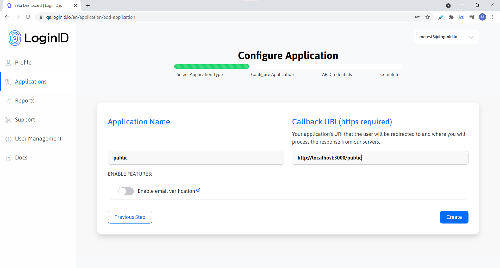
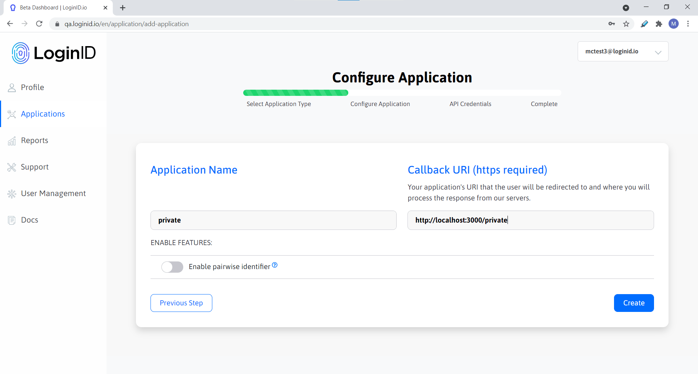

# oidc-client

A super simple client for oauth2-service.

## Required

- NodeJS (min version 16)

## Setup

### env

A .env file is needed at the root of the project with the following variables:

```
LOGIN_URL=               # The base URL to request the OAuth2 endpoints from. Eg https://oauth2.pentest.loginid.io
PUBLIC_CLIENT_ID=        # The client ID for the public OIDC client.
PRIVATE_CLIENT_ID=       # The client ID for the private OIDC client.
PRIVATE_CLIENT_KEY=      # The private key associated with <PRIVATE_CLIENT_ID>.
BASE_URL=                # OPTIONAL: The base URL to run the server on. Defaults to http://localhost:
PORT=                    # OPTIONAL: The port number to run the server on. Defaults to 3000.
```

To run this application fully, 2 OIDC clients are needed. A public and a private OIDC client. The private key associated with the private client is also needed. Make sure to add the client IDs and private key to the .env file.

When creating the clients make sure the callback URLs for the public client is **<BASE_URL>/pubic** and the private client with **<BASE_URL>/private** respectively. The app will not run properly if callback URL is incorrect.

Here are some examples:





## Running the App

Enter:

```
$ npm start
```

App will be running at <BASE_URL>:<PORT> or defaulted to http://localhost:3000.
